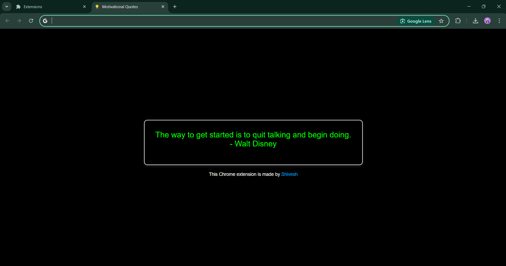

# Motivational Quotes Chrome Extension

This Chrome extension replaces your default new tab page with a simple, elegant interface that displays a random motivational quote every time you open a new tab. It also includes an attribution link to the creator's LinkedIn profile.

## Features

- Displays a random motivational quote every time a new tab is opened.
- Clean and professional user interface with a black background, white border, and quotes in green and red text.
- Attribution to the creator, with a clickable link to the developer's LinkedIn profile.

## Preview

 <!-- Add a screenshot here -->

## Installation (Developer Mode)

To install the extension in Developer Mode for testing purposes:

1. Clone the repository to your local machine:

   ```bash
   git clone https://github.com/yourusername/motivational-quotes-extension.git

2. Open Google Chrome and go to

   ```bash
   chrome://extensions/.

3. Enable Developer Mode (toggle is in the upper-right corner).

4. Click on Load unpacked and select the folder where you cloned this repository.

5. The extension will be loaded and available for use in the browser. You can open a new tab to see it in action.

## Folder Structure

motivational-quotes-extension/
│
├── manifest.json       # Configuration and metadata for the Chrome extension
├── newtab.html         # The HTML page displayed when a new tab is opened
├── script.js           # JavaScript to handle quote display logic
├── favicon.png         # Icon displayed on the tab (favicon)
├── icon16.png          # Extension icon (16x16)
├── icon48.png          # Extension icon (48x48)
├── icon128.png         # Extension icon (128x128)
├── README.md           # This documentation file
